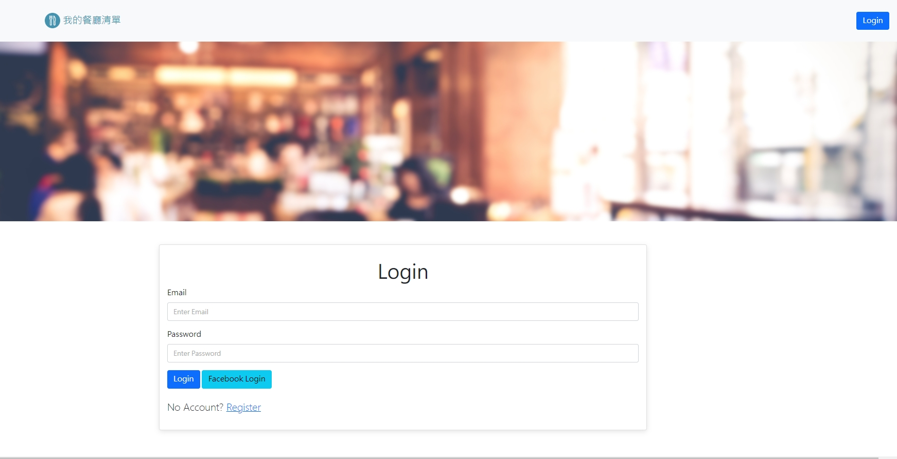

# Restaurant List (Final)

讓使用者可以登入並且瀏覽餐廳資料、修改、新增。

## 功能介紹
* 創建使用者
* 使用者可使用第三方登入(FACEBOOK)
* 瀏覽餐廳及其細節
* 創建餐廳資料
* 修改餐廳資料
* 可連結到GOOGLE MAP

## 強化部分
* 新增使用者登入、註冊、Facebook登入功能。
* 錯誤訊息提示。

## 首頁瀏覽



## 環境建置與需求 
* npm 
* node.js 

## 安裝
1. 將專案 clone 到本地
2. 透過終端機進入資料夾，輸入:
   ```
   npm install
   ```
3. 設定環境變數，請參考.env.example範例新增一個.env檔案

   ```
   FACEBOOK_ID=SKIP
   FACEBOOK_SECRET=SKIP
   FACEBOOK_CALLBACK=http://localhost:3000/auth/facebook/callback
   SESSION_SECRET=USER_DEFINED
   MONGODB_URI=YOUR MONGODB_URI
   PORT=3000
   ```
4. 執行完畢之後輸入已下程式碼以執行種子資料。
   ```
   npm run seed
   ```
5. 看到以下訊息表示種子資料運行成功。
   ```
   restaurantSeeder done!
   ```
6. 執行程式
   ```
   npm run dev
   ```   
7. 看見此行訊息則代表順利運行
   ```
   express now is listening on port 3000.
   ```
8. 請在瀏覽器輸入以下網址:
   http://localhost:3000
9. 有提供兩組使用者可供測試:
   ```
   * User1
     email: user1@example.com
     password: 12345678

   * User2
     email: user2@example.com
     password: 12345678
   ```
10. 結束使用請在終端機中輸入:
   ```
   ctrl + c
   ```
12. 再次開啟，從步驟5開始。

## 開發工具及套件

* Node.js 16.17.1
* Express 4.17.1
* Express-Handlebars 4.0.2
* Express-session 1.17.1
* Mongoose 5.9.7
* Bootstrap 4.1.3
* Font-awesome 6.2.0
* Nodemon 2.0.20
* Method-override 3.0.0
* Bcryptjs 2.4.3
* Connect-flash 0.1.1
* Dotenv ^8.2.0
* Passport 0.4.1
* Passport-facebook 3.0.0
* Passport-local 1.0.0

