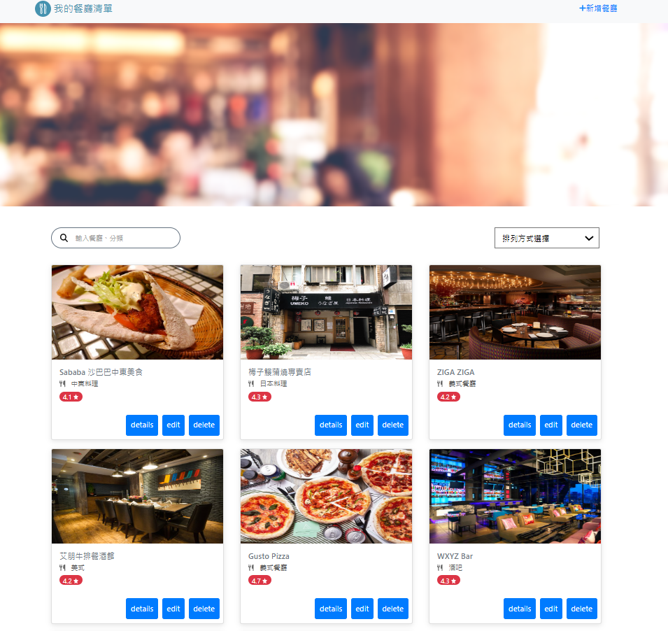

# Restaurant List (Refactoring)

讓使用者可以瀏覽餐廳資料、並修改、新增。

## 功能介紹
* 瀏覽餐廳及其細節
* 創建餐廳資料
* 修改餐廳資料
* 可連結到GOOGLE MAP

## 強化部分
* 參考 RESTful 設計，運用 HTTP 動詞來讓路由帶有語義。
* 使用 express.Router 獨立路由器，並規劃路由模組。
* 優化視覺效果。

## 首頁瀏覽



## 環境建置與需求 
* npm 
* node.js 

## 安裝
1. 將專案 clone 到本地
2. 透過終端機進入資料夾，輸入:
   ```
   npm install
   ```
3. 設定 MongoDB 環境變數

   ```
   For Windows cmdset: "MONGODB_URI=你的MongoDB連線字串" 

   For MacOS & Git Bash: "export MONGODB_URI="你的MongoDB連線字串"
   ```
4. 執行完畢之後輸入已下程式碼以執行種子資料。
   ```
   npm run seed
   ```
5. 看到以下訊息表示種子資料運行成功。
   ```
   restaurantSeeder done!
   ```
6. 執行程式
   ```
   npm run dev
   ```   
7. 看見此行訊息則代表順利運行
   ```
   express now is listening on prot 3000.
   ```
8. 請在瀏覽器輸入以下網址:
   http://localhost:3000
9. 結束使用請在終端機中輸入:
   ```
   ctrl + c
   ```
10. 再次開啟，從步驟5開始。

## 開發工具

* Node.js 16.17.1
* Express 4.17.1
* Express-Handlebars 4.0.2
* Mongoose 5.9.7
* Bootstrap 4.1.3
* Font-awesome 6.2.0
* nodemon 2.0.20
* method-override 3.0.0
